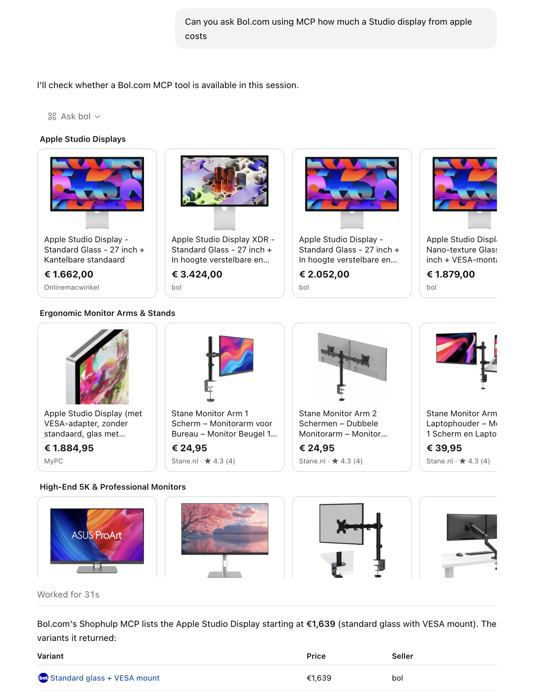

# bol-mcp

MCP server that exposes bol.com's "Shophulp" AI shopping assistant as one tool, `ask_bol`. Sibling of [mediamarkt-mcp](https://github.com/foeken/mediamarkt-mcp).



*ChatGPT calling `ask_bol` with `BOL_UI=widget`: one MCP Apps carousel row per Shophulp recommendation group, the model works from the text and structured data.*

## How it works

bol's Shophulp page POSTs an OpenAI-style streaming request to `https://www.bol.com/streaming/api/v1/chat/completions` (model `gemini-3.5-flash`, `stream: true`, `user` = a chat/thread UUID). No login or cookies are needed; a browser User-Agent and `Accept: text/event-stream` suffice. The SSE stream carries normal `chat.completion.chunk` deltas plus `t800.tool_outputs` chunks with grouped product recommendations (title, summary, products with price, seller, rating, image, url), a follow-up question and suggestion chips. This server flattens that into `text` + `structuredContent`.

Unofficial endpoint: it can change or be blocked at any time (bol.com sits behind Akamai Bot Manager). See bol's [privacy policy](https://www.bol.com/nl/nl/tc/privacybeleid).

## Install

```sh
npm install
npm run check   # live smoke test against bol.com
```

## Run

```sh
node index.mjs                 # text mode (default)
BOL_UI=widget node index.mjs   # widget mode (MCP Apps carousel)
PORT=3001 node index.mjs       # use another HTTP port
node index.mjs --stdio        # stdio transport instead
```

Widget mode is opt-in because its UI domain must be configured for the deployment. For a remote host, replace the `ui.domain` value in `index.mjs` with that host's reachable HTTPS origin, for example `https://mcp.example.com` (origin only, without `/mcp`). This is separate from `BOL_MCP_PUBLIC_URL`, which is the MCP endpoint and includes `/mcp`. Then set `BOL_UI=widget`; otherwise leave it unset for text mode.

| Variable | Values            | Default | Effect |
| -------- | ----------------- | ------- | ------ |
| `PORT`   | number            | `3000`  | HTTP port |
| `BOL_UI` | `text` \| `widget` | `text`  | `widget` attaches an [MCP Apps](https://modelcontextprotocol.io/docs/extensions/apps) carousel (`ui://bol/product-carousel.html`), one row per recommendation group |

## Connect

```sh
codex mcp add bol --url http://localhost:3000
```

For ChatGPT, expose the HTTP server publicly (e.g. `cloudflared tunnel --url http://localhost:3000`) and add the URL under Settings → Apps in developer mode. Run with `BOL_UI=widget` for the carousel.

## Tool

`ask_bol({ question })` — any language; Shophulp answers in the language of the question, product names stay Dutch. Returns `content[0].text` (assistant text, or the group summaries plus follow-up question when Shophulp answers with groups only) and `structuredContent` with `products[]` (`id`, `name`, `group`, `price`, `currency`, `seller`, `rating`, `reviewCount`, `image`, `url`), `groups[]` (`title`, `summary`), `followUp` and `suggestions[]`.
